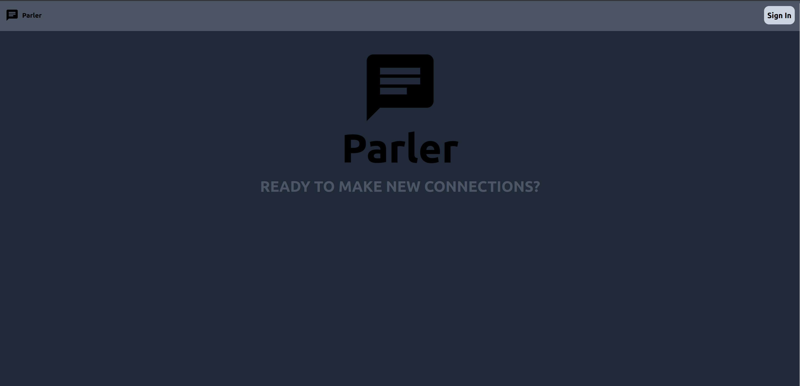

# Parler
A chatroom app where all app users are in a single chat room!

Users can upvote or downvote messages

the website is built with __React TS__ and the backend is built using __Go__ using __Gin framework__

clients open a websocket with the sever in order to get real time updates of new messages. 
currently Votes are not updated in real time, users need to reload the page

# setup:
## Frontend:
```bash
## from root directory
cd client

# Run the image in detached mode 
sudo docker compose up -d
```

## Backend:
create a .env file with the following variables and place it in /server
```
#.env
GIN_MODE=release
TOKEN_HOUR_LIFESPAN=4
JWT_SECRET=256-bit random secret key
DATABASE_HOST=
POSTGRES_USER=
POSTGRES_PASSWORD=
POSTGRES_NAME=
```

```bash
## from root directory
cd server
```
to run manually user docker compose
```
sudo docker compose up -d
```



